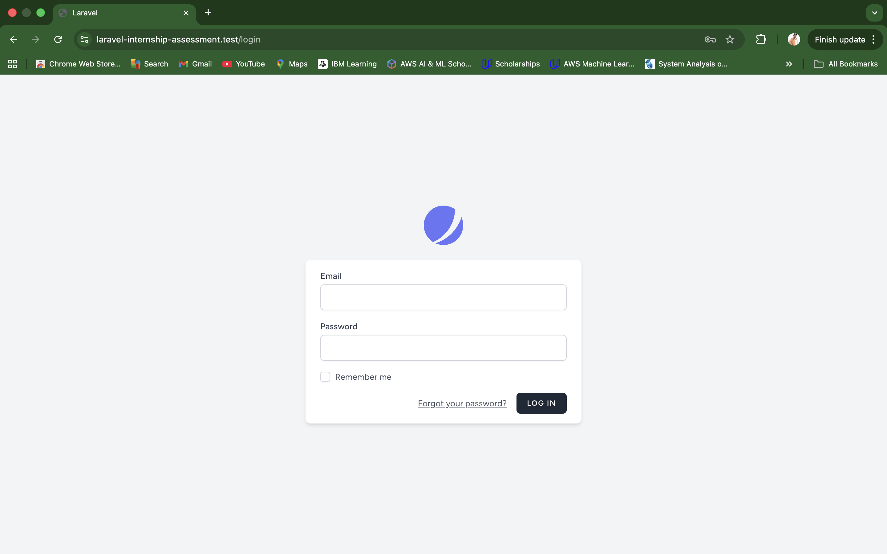
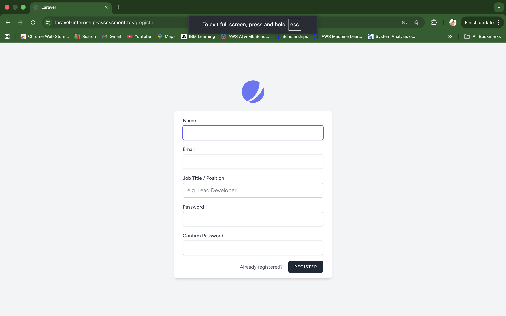
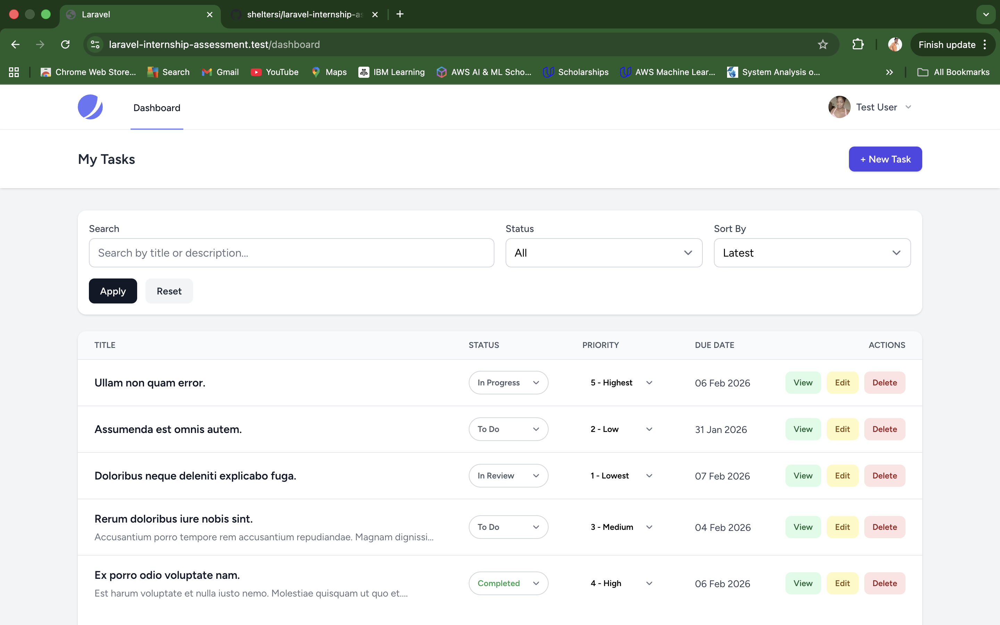
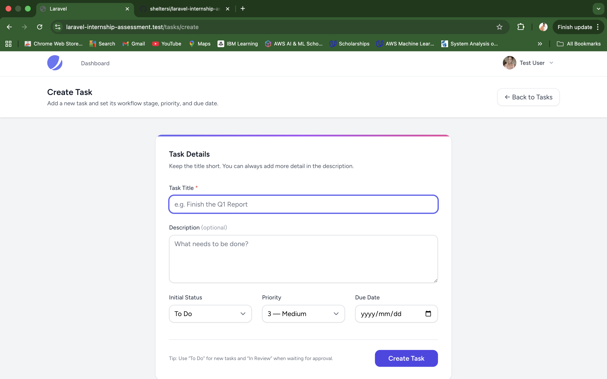
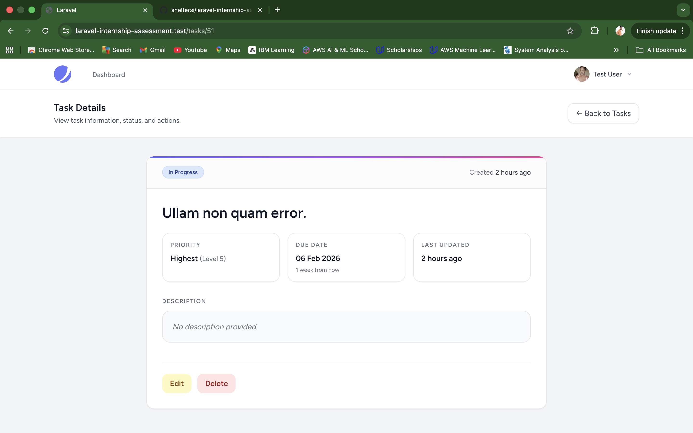
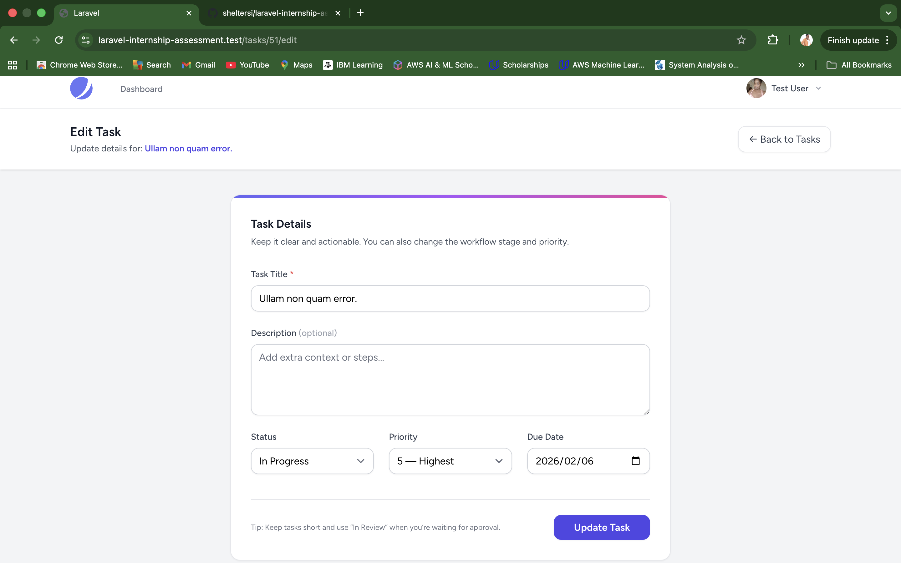

# ✅ Laravel Task Management System

A robust, personalized **Task Management System** built for the **[Laravel Developer Internship] Assessment**.  
This project demonstrates proficiency in **Laravel 12**, **Blade Templates**, **Jetstream (Livewire)**, authentication, authorization, and modern UI/UX practices.

Users can securely manage tasks with **filtering, sorting, search, priorities, and due dates**, all within a clean and responsive interface.

---

## 🚀 Features

- ✅ **Authentication & User Accounts** (Laravel Jetstream)
- ✅ **Full Task CRUD**
  - Create, view, update, and delete tasks
- ✅ **Advanced Filtering**
  - Filter tasks by status (**To Do, In Progress, In Review, Completed**)
- ✅ **Smart Sorting**
  - Sort tasks by **Priority** or **Due Date**
- ✅ **Real-time Search**
  - Search tasks by title or description
- ✅ **Custom User Profiles**
  - Added a custom **Position** field
  - Profile photo integration (Jetstream)
- ✅ **Enhanced UI/UX**
  - SweetAlert2 confirmations for delete actions
  - Modern Tailwind UI design
- ✅ **Security & Authorization**
  - Uses **Laravel Policies** to ensure users only access their own tasks

---

## 🛠 Tech Stack

- **Backend**: Laravel 12
- **Frontend**: Tailwind CSS + Jetstream (Livewire) + Blade Templates
- **Database**: MySQL
- **JS Libraries**: SweetAlert2, Alpine.js
- **Environment**: Laravel Valet / Localhost

---

## 📸 Screenshots

### 🔐 Authentication
  


### 📋 Task Dashboard


### ➕ Create Task


### 👁 Task Details


### ✏️ Edit Task


### 👤 Profile Page


---

## 📦 Installation & Setup

### 1) Clone the repository
```bash
git clone https://github.com/sheltersi/laravel-internship-assessment.git
cd laravel-internship-assessment 
```

#### 2) Install dependencies
```bash
composer install
npm install
```

### 3) Create your .env file **
```bash
cp .env.example .env
```

### 4) Generate app key
```bash
php artisan key:generate
```
### 5) Configure your database
```bash
DB_CONNECTION=mysql
DB_HOST=127.0.0.1
DB_PORT=3306
DB_DATABASE=task_manager
DB_USERNAME=root
DB_PASSWORD=
```
### 6) Run migrations
```bash
php artisan migrate
```
### 7) Build frontend assets
```bash
npm run dev
```
### 8) Start the server
```bash
php artisan serve
```

Now open the app in your browser:
http://127.0.0.1:8000

### 🧪 Testing (Optional)
```bash
php artisan test
```

### 📌 Notes

Built using Laravel Jetstream (Livewire) for fast, secure authentication and UI scaffolding.

Designed with focus on clean architecture, data privacy, and professional UX.
